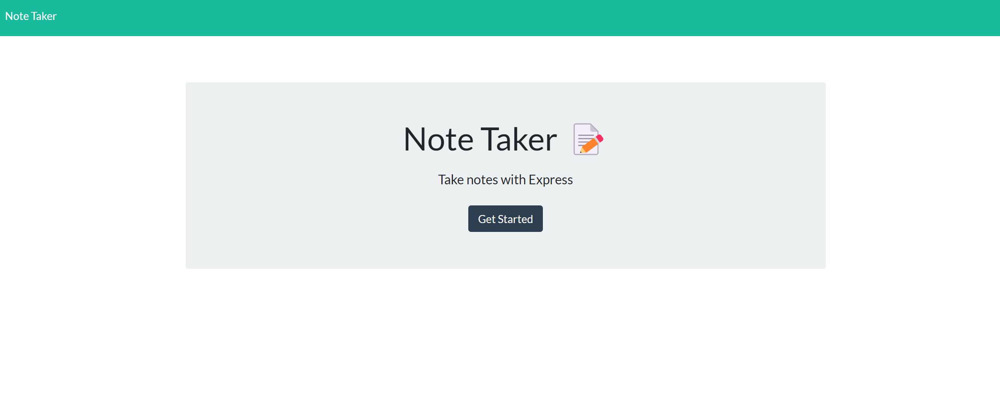
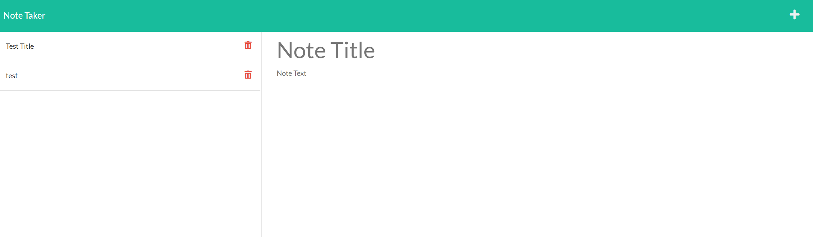
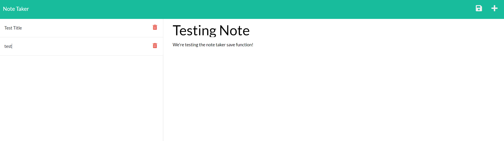
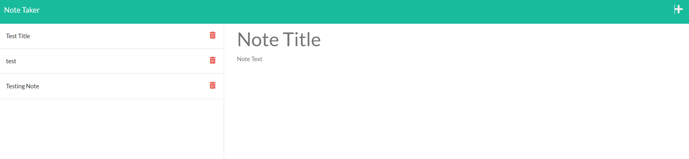

[![Contributors][contributors-shield]][contributors-url]
[![Forks][forks-shield]][forks-url]
[![Stargazers][stars-shield]][stars-url]
[![Issues][issues-shield]][issues-url]
[![MIT License][license-shield]][license-url]

<!-- PROJECT LOGO -->
 

    

  <h3 align="center">Weather Dashboard README</h3>

  

    Welcome to the Weather Dashboard README, a great spot to get to know this project!
     
    <a href="https://github.com/danpoggetti/weather-dashboard"><strong>Explore the docs »</strong></a>
     
     
    <a href="https://note-taker-danp.herokuapp.com/">View Demo</a>
    ·
    <a href="https://github.com/danpoggetti/note-taker/issues">Report Bug</a>
    ·
    <a href="https://github.com/danpoggetti/note-taker/issues">Request Feature</a>
  

<!-- TABLE OF CONTENTS -->

  
Table of Contents

  <ol>
    <li>
      <a href="#about-the-project">About The Project</a>
      <ul>
        <li><a href="#built-with">Built With</a></li>
      </ul>
    </li>
    <li><a href="#getting-started">Getting Started</a></li>
    <li><a href="#usage">Usage</a></li>
    <li><a href="#roadmap">Roadmap</a></li>
    <li><a href="#contributing">Contributing</a></li>
    <li><a href="#license">License</a></li>
    <li><a href="#contact">Contact</a></li>
    <li><a href="#acknowledgments">Acknowledgments</a></li>
  </ol>

<!-- ABOUT THE PROJECT -->
## About The Project

I was tasked with creating an app that can help write and save notes. I want a user to be able to:
<ol>
  <li>Add a title, note/task and click save</li>
  <li>Clicking save, populates the task on the left side</li>
  <li>When a previous note is clicked, it will display</li>
</ol>

 

(<a href="#readme-top">back to top</a>)

### Built With

Below are the following technologies and applications utilized to help build the app. 

VS Code 
JavaScript 
HTML 
Node.js 
Heroku 

(<a href="#readme-top">back to top</a>)

<!-- GETTING STARTED -->
## Getting Started

Below you'll be able to see screen shots of the deployed app. You can also view the road map to see how you can test it locally.

(<a href="#readme-top">back to top</a>)

<!-- USAGE EXAMPLES -->
## Usage

Here's a screen shot of what the app looks like when someone is viewing it at different stages. 

 
 
 
 

(<a href="#readme-top">back to top</a>)

<!-- ROADMAP -->
## Roadmap

WHEN I open the Note Taker
THEN I am presented with a landing page with a link to a notes page
WHEN I click on the link to the notes page
THEN I am presented with a page with existing notes listed in the left-hand column, plus empty fields to enter a new note title and the note’s text in the right-hand column
WHEN I enter a new note title and the note’s text
THEN a Save icon appears in the navigation at the top of the page
WHEN I click on the Save icon
THEN the new note I have entered is saved and appears in the left-hand column with the other existing notes
WHEN I click on an existing note in the list in the left-hand column
THEN that note appears in the right-hand column
WHEN I click on the Write icon in the navigation at the top of the page
THEN I am presented with empty fields to enter a new note title and the note’s text in the right-hand column

See the [open issues](https://github.com/danpoggetti/note-taker/issues) for a full list of proposed features (and known issues).

(<a href="#readme-top">back to top</a>)

<!-- CONTRIBUTING -->
## Contributing

I strongly feel that contributing well throught and engaging suggestions are instrumental. I am an avid learner and want to let you know any contribution or suggestions are apprecaited.

If you truly believe you can contribute to making this website better, please fork the repo and create a pull request. If you do not wish to fork, you can open and create an issue with the tag "enhancement" or "suggestions". I will then be able to review it and take it into consideration. Lastly, please don't forget to give the project a star!

1. Fork the Project
2. Create your Feature Branch (`git checkout -b feature/newSuggestion`)
3. Commit your Changes (`git commit -m 'Add some NewSuggestion'`)
4. Push to the Branch (`git push origin feature/NewSuggestion`)
5. Open a Pull Request

(<a href="#readme-top">back to top</a>)

<!-- LICENSE -->
## License

Distributed under the MIT License. 
Copyright (c) 2022 Dan Poggetti 
See License.text for more information.

(<a href="#readme-top">back to top</a>)

<!-- CONTACT -->
## Contact

Dan Poggetti - GitHub [https://github.com/danpoggetti]

Project Link: [https://github.com/danpoggetti/note-taker]

Demo Link: [https://note-taker-danp.herokuapp.com/]

(<a href="#readme-top">back to top</a>)

<!-- ACKNOWLEDGMENTS -->
## Acknowledgments

I want to acknowledge the many great and vast resouces that adided us in creating this weather dashboard app.

* [Google](https://www.google.com)
* [YouTube](https://www.youtube.com)
* [GitHub Pages](https://pages.github.com)
* Jacob Carver
* [README Template courtesy of othneildrew](https://github.com/othneildrew/Best-README-Template)
* [MIT License text](https://mit-license.org/license.txt)
* [Shields.io for badges](https://shields.io/)

(<a href="#readme-top">back to top</a>)

<!-- MARKDOWN LINKS & IMAGES -->
<!-- https://www.markdownguide.org/basic-syntax/#reference-style-links -->
[contributors-shield]: https://img.shields.io/github/contributors-anon/danpoggetti/weather-dashboard?style=for-the-badge
[contributors-url]: https://github.com/danpoggetti/weather-dashboard/graphs/contributors
[forks-shield]: https://img.shields.io/github/forks/danpoggetti/weather-dashboard?style=for-the-badge
[forks-url]: https://github.com/danpoggetti/weather-dashboard/network/members
[stars-shield]: https://img.shields.io/github/stars/danpoggetti/weather-dashboard?style=for-the-badge
[stars-url]: https://github.com/danpoggetti/weather-dashboard/stargazers
[issues-shield]: https://img.shields.io/github/issues/danpoggetti/weather-dashboard?style=for-the-badge
[issues-url]: https://github.com/danpoggetti/weather-dashboard/issues
[license-shield]: https://img.shields.io/github/license/danpoggetti/weather-dashboard?style=for-the-badge
[license-url]: https://github.com/danpoggetti/weather-dashboard/blob/main/LICENSE
[product-screenshot]: images/screenshot.png
